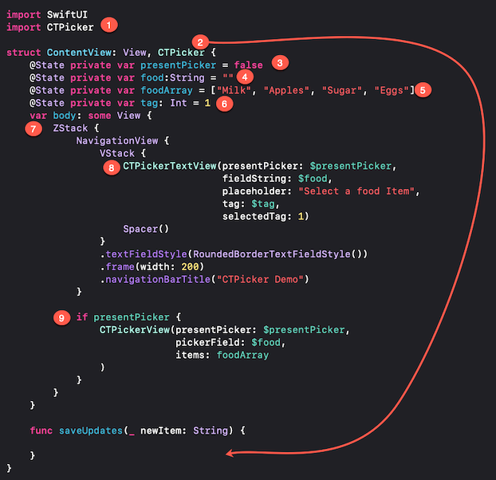

# CTPicker_SwiftUI

[](https://developer.apple.com/iphone/index.action)[](https://developer.apple.com/swift)

### What is this?


If you wish to limit your user to picking from an array of strings, then one of the default SwiftUI pickers may meet your needs.  However, as the number of entries grow, these controls may not be very efficient.  With `CTPicker`  you can present the user with a list of all options but with a filter text field that will filter as you type to zoom in on the preferred value.  If the value is not available, there is also the optional "add" button to allow your users to add to the data source of options.

### Requirements

- iOS 13.0+
- Xcode 11.0+
- SwiftUI
### YouTube Video

Watch this video to see installation and use as described below. Additional tips for adding more than one CTPickerView to a SwiftUI view is also presented in the video.

https://www.youtube.com/watch?v=0DqLReYTry8

<iframe width="560" height="315" src="https://www.youtube.com/embed/0DqLReYTry8" frameborder="0" allow="accelerometer; autoplay; encrypted-media; gyroscope; picture-in-picture" allowfullscreen></iframe>

#### The Starting Example

The best way to explain how to implement CTPicker is to work through an example  of how to add CTPicker to a view containing a single TextField.  The example is a TextField that asks the user to enter a food item.

```swift
struct ContentView: View {
    @State private var food:String = ""
    var body: some View {
        NavigationView {
            VStack {
                TextField("Enter food", text: $food)
                Spacer()
            }
            .textFieldStyle(RoundedBorderTextFieldStyle())
            .frame(width: 200)
            .navigationBarTitle("CTPicker Demo")
        }
    }
}
```

### Installation

1. From within Xcode 11 or later, choose **File > Swift Packages > Add Package Dependency**
2. At the next screen enter https://github.com/StewartLynch/CTPicker_SwiftUI when asked to choose a Package repository
3. Choose the latest available version.
4. Add the package to your target.

You now have the dependency installed and are ready to import CTPicker

### Set up

Setting up to use this solution to change the TextField into a CTPicker is straight forward.

##### Step 1 - Import CTPicker

In the View where you are going to implement `CTPicker` on your TextField, import CTPicker.

```swift
import CTPicker
```

##### Step 2 - Create initial presentation @State variable

The next step is to create the presentation boolean variable that when set to true, will present the picker.  As this will be changed in the view, it must be created as an @State variable.  The initial value is set to false.

```swift
@State private var presentPicker:Bool = false
```

##### Step 3 - Create String Arrays @State variables if necessary

When presenting the CTPickerView, you will be asked to pass in the array of strings and this array will be bound to a @Binding variable in the CTPickerView so that if you append to the array, it will be updated in your content view as well. (See saving data below). 

You can pass in any array of strings,  but to continue on with this example, I will just create it within the existing view and it must be created as an @State variable (or be the property of an @ObservedObject)

```swift
@State private var foodArray = ["Milk", "Apples", "Sugar", "Eggs"]
```

##### Step 4 - Enclose exsiting view in a ZStack

The CTPickerVew is a view that will be presented on top of the exsiting view.  To allow this, we need to surround the existing view including the NavigationView if one exists within a `ZStack`

### 

##### Step 5  - Conditionally Present the CTPicker

You can now add, as the second item in the ZStack, a conditional presentation of the CTPickerView.  The condition will be whenever our `presentPicker` boolean value is set to `true`.  

The CTPickerView by default requires 3 parameters which are the 3 state variables:

- the presentation boolean -  `$presentPicker`
- the TextField state variable - `$food`
- The string array - `$foodArray`

```swift
 if presentPicker {
    CTPickerView(presentPicker: $presentPicker,
                 pickerField: $food,
                 items: $foodArray)
}
```

##### Step 6 - Disable Entry into the TextField and add onTapGesture

To present the picker, we must first disable entry into the TextField  (`.disabled(true)`) and subsequently add an `.onTapGesture` to the TextField.

```swift
TextField("Enter food", text: $food).disabled(true)
    .onTapGesture {
            
}
```

##### Step 7 - Set the presentation state variable to true

WIthin the onTapGesture closure block we can set the `presentPicker` variable to true.  To make the presentation more visual, we can do this within a `withAnimation` block.

```swift
withAnimation {
   self.presentPicker = true
}
```
The final result looks like this (numbers refer to steps above)



If you run your app now, you will find that this is indeed a functional picker.  However, we have not yet added the ability to add items.

##### Step 8 - Enabling Adding of Items

To add items, you first need to create a function that will get executed when the picker closes.  This function accepts one parameter, a string that will be the item added.

**Note:** Since the array being passed to the CTPickerView is bound to CTPickerView, it will be updated, but you may wish to capture that value and update your back end data store in a way that requires this entry.  You may, or may not need this data, but the update function requires it.  It of course, can be ignored.

In any case, the function will allow you to persist data between sessions.

Create a function like this:

```swift
func saveUpdates(newItems:String) {
   // Do whatever you want to with this new item
   // You may need to update and save the data for persistence
}
```

##### Step 9 - Add the saveUpdates parameter to your CTPickerView

With the function created, you can now add the additional `saveUpdates` parameter to your CTPickerView.

```swift
CTPickerView(presentPicker: $presentPicker,
             pickerField: $food,
             items: $foodArray,
             saveUpdates: saveUpdates)
```

If you run the application now, you will see that the picker has an Add button on the top right.  If you enter a value in the filter field that does not match any of the existing items, it will be enabled.  When you tap it, the item gets added to the array and runs the `saveUpdates` function, passing in this new value and the `CTPickerView` is dismissed.  If you tap the field again, you will see your new entry in the selection list and the TextField is populated with this value

##### Step 9 - Fixing the dismissal Animation

You will see that when the CTPickerView dismisses, it is immediate. There is no animation.  I believe that this is a bug in SwiftUI, but there is a quick fix.

Right after your CTPickerView has been created, but still within the `if presentPicker` block enter:

```swift
.zIndex(1)
```

### Optional Parameters

There are three additional optional parameters that you can pass to the CTPickerView.  

##### Item Sorting

By default, the items in your array are sorted alphabetically.  If you wish to keep the sort order of your string array as is, you can pass the optional parameter

```swift
noSort: true
```

this must be added after the `saveUpdates` parameter  if you have one. If not, it follows the `items` parameter.

##### Custom Colors

You can change the color of the top buttonbar of the `CTPickerView` and the tint of the buttons.  You can change one or both.

The easiest way to do this is to create an instance of `CTPColors`at the top of your struct, including one or both of the two properties which are UIColor.  For example:

```swift
let ctpColors = CTPColors(headerBackgroundColor: .black,
                          headerTintColor: .orange)
```

Now you can add this as the next parameter in your CTPickerView

```swift
ctpColors: ctpColors
```

##### Custom Strings

The final option is to change one or more of the strings used in CTPickerView. The default values are:

```swift
pickText - "Tap an entry to select it, or type in new entry.",
addText - "Type new entry then tap '+' button to add new entry",
noItemText - "No items match",
searchPlaceHolder - "Filter by entering text...",
newEntry - "New Entry",
cancelBtnTitle - "Cancel"
```

As with the `CTPColors`, you can create an instance of `CTPStrings` and change one or more of the properties.  For example, if all you want to to is change the `cancelBtnTitle` property, you can create your ctpStrings instance like this:

```swift
let ctpStrings = CTPStrings(cancelBtnTitle: "Dismiss")
```

and then, add the final parameter to your CTPickerView

```
ctpStrings: ctpStrings
```

Here is your CTPickerView with the saveUpdates function and all optional parameters as well as the fix for the dismissal animation.


If you are more of a visual learner and also want to get tips on how to add more than one CTPickerView to a single SwiftUI View, please watch the YouTube video.

https://www.youtube.com/watch?v=0DqLReYTry8

Interested in a UIKit version of CTPicker?  See https://github.com/StewartLynch/CTPicker