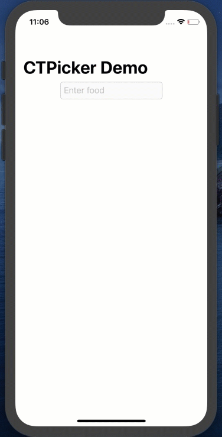
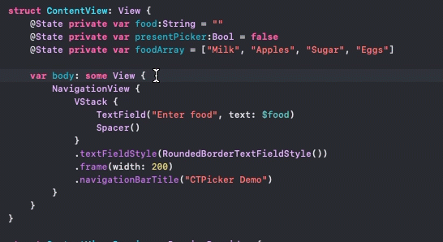
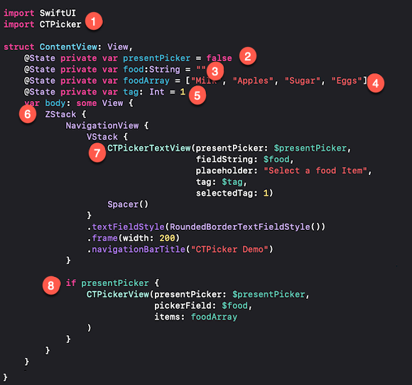
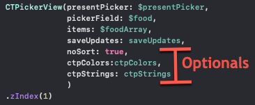

#              CTPicker_SwiftUI

[](https://developer.apple.com/iphone/index.action)[](https://developer.apple.com/swift)

> **Note:** Version 2 has been updated to fix some bugs introduced in SwiftUI.  The implementation has changed.  Please read the documentation before you update if you are using version 1.0.x

### What is this?



If you wish to limit your user to picking from an array of strings, then one of the default SwiftUI pickers may meet your needs.  However, as the number of entries grow, these controls may not be very efficient.  With `CTPicker`  you can present the user with a list of all options but with a filter text field that will filter as you type to zoom in on the preferred value.  If the value is not available, there is also the optional "add" button to allow your users to add to the data source of options.

### Requirements

- iOS 13.0+
- Xcode 11.0+
- SwiftUI
#### The Starting Example

The best way to explain how to implement CTPicker is to work through an example  of how to add CTPicker to a view.  In this example, I will add change the TextField into a CTPickerTextView.  The example is a TextField that asks the user to enter a food item. You can follow along by creating a project using SwiftUI and replace ContentView with the following.

```swift
NavigationView {
    VStack {
        TextField("Select a Food item", text: $food)
        Spacer()
    }
    .padding(.top)
    .textFieldStyle(RoundedBorderTextFieldStyle())
    .frame(width: 300)
    .navigationTitle("CTPicker2-Demo")
}
```

### Installation

1. From within Xcode 11 or later, choose **File > Swift Packages > Add Package Dependency**
2. At the next screen enter https://github.com/StewartLynch/CTPicker_SwiftUI when asked to choose a Package repository
3. Choose the latest available version.
4. Add the package to your target.

You now have the dependency installed and are ready to import CTPicker

### Set up

Setting up to use this solution to change the TextField into a CTPicker is straight forward.

##### Step 1 - Import CTPicker

In the View where you are going to implement `CTPicker` on your TextField, import CTPicker.

```swift
import CTPicker
```

##### Step 2 - Create initial presentation @State variable

The next step is to create the presentation boolean variable that when set to true, will present the picker.  As this will be changed in the view, it must be created as an @State variable.  The initial value is set to false.

```swift
@State private var presentPicker:Bool = false
```

##### Step 3 - Create @State variable for your TextField content

Each TextField requires a binding to an @State variable.

````swift
@State private var food:String = ""
````

##### Step 4 - Create String Array and make it @State variable if necessary

When presenting the CTPickerView, you need to pass in an array of strings.  If you are going to allow users to be able to add to the array, it will have to be decorated with the @State property wrapper.

> Watch the video to see how you can submit and modify a collection of objects from which your string array has been created.

```swift
@State private var foodArray = ["Milk", "Apples", "Sugar", "Eggs", "Oranges", "Potatoes", "Corn", "Bread"]
```

##### Step 5 - Create a tag @State Integer variable

Every CTPicker TextField must have a tag associated with it so that you will be able to present the correct picker and save updates if you have more than one picker on your view.

````swift
@State private var tag: Int = 1
````

##### Step 6 - Enclose existing view in a ZStack

The CTPickerVew is a view that will be presented on top of the existing view.  To allow this, we need to embed the existing view including the NavigationView, if one exists, within a `ZStack`

### 

##### Step 7 - Create a CPickerTextView

Create, or, if you already have a TextField in your view, replace it with a CTPickerTextView.  This view requires that you pass in a binding to your presesentPicker, and fieldString state variables along with the placeholder text, a binding to the tag @State variable and a tag value for your CTPickerTextView.  If you only have one TextField, you can set the selectedTag to 1.

 ````swift
CTPickerTextView(presentPicker: $presentPicker,
                 fieldString: $food,
                 placeholder: "Select a food Item",
                 tag: $tag,
                 selectedTag: 1)
 ````

##### Step 8  - Conditionally Present the CTPicker

You can now add, as the second, frontmost view in the ZStack, a conditional presentation of the CTPickerView.  The condition will be whenever our `presentPicker` boolean value is set to `true`.  

The CTPickerView by default requires 3 parameters.

- the presentation boolean -  `$presentPicker`
- the TextField state variable - `$food`
- The string array - `foodArray`

```swift
if presentPicker {
    CTPickerView(presentPicker: $presentPicker,
                 pickerField: $food,
                 items: foodArray,
    )
}
```

The final result looks like this (numbers refer to steps above)



If you run your app now, you will find that this is indeed a functional picker.  However, we have not yet added the ability to add items.

### Adding items to your array (Optional)

If you wish to allow users to update items in the picker arrays, you will need to create a **saveUpdates** function.

##### Step 1 - Create a SaveUpdates function

Create a function called saveUpdates that has a single `newItem` string parameter

> ````swift
> func saveUpdates(_ newItem: String) {
>  
> }
> ````

When you add an item in CTPickerView, the `saveUpdates` function is executed with a string `newItem` argument.  

It is up to you to add code that will update your array with this new time, and, if required, persist the data.

In our case, this is straight forward as we have an array of strings, so I can just append the new item.

```swift
func saveUpdates(_ newItem:String) {
   foodArray.append(newItem)
}
```

##### Step 2 - Add the saveUpdates argument to your CTPickerView

Add the `saveUpdates` function as an argument when presenting CTPickerView.  It is added right after your items argument.

````swift
CTPickerView(presentPicker: $presentPicker,
             pickerField: $food,
             items: foodArray,
             saveUpdates: saveUpdates
)
````

If you run the application now, you will see that the picker has an `Add` button on the top right.  If you enter a value in the filter field that does not match any of the existing items, you can tap the `+`button. The `saveUpdates` function is called, passing in this new value and the `CTPickerView` is dismissed. 

If you update your array in the saveUpdates function you will see your new entry in the selection list when you tap on the field again.

### Fixing the dismissal Animation

You will see that when the CTPickerView dismisses, it is immediate. There is no animation.  I believe that this is a bug in SwiftUI, but there is a quick fix.

Right after your CTPickerView has been created, but still within the `if presentPicker` block enter:

```swift
.zIndex(1)
```

### Optional Parameters

There are three additional optional parameters that you can pass to the CTPickerView.  

##### Item Sorting

By default, the items in your array are sorted alphabetically.  If you wish to keep the sort order of your string array as is, you can pass the optional parameter.

```swift
noSort: true
```

This must be added after the `saveUpdates` parameter  if you have one. If not, it follows the `items` parameter.

##### Custom Colors

You can change the color of the top buttonbar of the `CTPickerView` and the tint of the buttons.  You can change one or both.

The easiest way to do this is to create an instance of `CTPColors`at the top of your struct, including one or both of the two properties which are UIColor.  For example:

```swift
let ctpColors = CTPColors(headerBackgroundColor: .black,
                          headerTintColor: .orange)
```

Now you can add this as the next parameter in your CTPickerView

```swift
ctpColors: ctpColors
```

##### Custom Strings

The final option is to change one or more of the strings used in CTPickerView. The default values are:

```swift
pickText - "Filter list then tap entry to select."
addText - "Filter list then tap entry to select, or type new entry then '+' to add."
searchPlaceHolder - "Filter by entering text..."
cancelBtnTitle - "Cancel"
```

As with the `CTPColors`, you can create an instance of `CTPStrings` and change one or more of the properties.  For example, if all you want to do is change the `cancelBtnTitle` property, you can create your ctpStrings instance like this:

```swift
let ctpStrings = CTPStrings(cancelBtnTitle: "Dismiss")
```

and then, add the final parameter to your CTPickerView

```
ctpStrings: ctpStrings
```

Here is your CTPickerView with the saveUpdates function and all optional parameters as well as the fix for the dismissal animation.



If you are more of a visual learner and also want to get tips on how to add more than one CTPickerView to a single SwiftUI View, please watch the YouTube video. 

<a href="http://www.youtube.com/watch?feature=player_embedded&v=EQgDcPpgdJk
" target="_blank"></a>

The video is comprehensive and also covers, in addition to above, the ability to use an Observable object and the new SwiftUI @AppStorage property wrapper to to persist data between sessions.

Interested in a UIKit version of CTPicker?  See https://github.com/StewartLynch/CTPicker